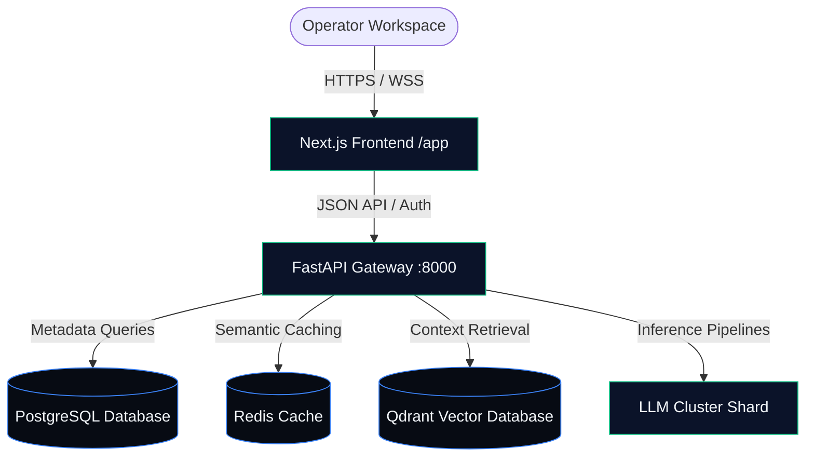

# PromptVerse X 🚀

PromptVerse X is an enterprise-grade AI operating system and visual cockpit designed for context engineering, prompt compilation, multi-agent orchestrations, semantic cache layers, and deterministic evaluation matrices.



---

## 🎨 Premium Visual Redesign

The user experience has been completely overhauled from standard templates to a custom, high-contrast dark visual interface:
- **Space-Age Typography**: Loaded Google `Space Grotesk` for technical elements/labels, `Inter` for content copy, and `JetBrains Mono` for real-time log outputs.
- **Interactive Canvas Backdrop**: A custom, high-performance node canvas draws a flowing grid responding to mouse coordinate inputs.
- **Prompt IDE Simulator**: A fully interactive terminal console on the landing page, simulating syntax analysis, AST evaluation, and performance testing for intent routing, planners, and guardrail scripts.
- **Telemetry Operations Console**:
  - Real-time animated circular progress meters monitoring CPU core loads, database connection pools, cache ratios, and vector shard volumes.
  - Scrolling logs capturing system pipeline directives.
  - Dynamic workspace forms letting operators spin up Postgres and Qdrant configurations in-memory during testing.

---

## 📂 Repository Structure

This project is organized as a monorepo workspace:

```
├── .github/workflows/    # CI lint & typecheck pipelines
├── apps/
│   ├── web/              # Next.js 15 App (React 19, Tailwind v4, PostCSS)
│   └── api/              # FastAPI Backend (Python 3.12, SQL Alchemy, Alembic)
├── packages/
│   └── database/         # Shared database schemas and migrations
├── docker-compose.yml    # Local services (PostgreSQL, Redis, Qdrant, Meilisearch)
└── pnpm-workspace.yaml   # Monorepo workspaces definition
```

---

## 🛠️ Quick Start & Local Setup

### Prerequisites
- **Node.js** v22+ and **pnpm**
- **Python** v3.12+ (managed with `virtualenv` or `uv`)
- **Docker Desktop** (for running databases)

### 1. Launch Storage Backends
Spin up PostgreSQL, Redis, and Qdrant services using docker-compose:
```bash
docker compose up -d
```

### 2. Launch FastAPI Backend
Navigate to the API folder, initialize your environment, and run the server:
```bash
cd apps/api
# Setup virtual environment
python -m venv .venv
source .venv/bin/activate  # On Windows: .venv\Scripts\activate

# Install dependencies and run development server
pip install -e ".[dev]"
uvicorn app.main:app --reload --port 8000
```

### 3. Launch Next.js Frontend
Navigate to the web folder and launch the web server:
```bash
cd apps/web
pnpm install
pnpm dev
```
Open `http://localhost:3000` to view the control console.

---

## 🧪 CI Quality Gates

All checks are automatically validated in Github Actions on push:
- **Frontend Checks**: ESLint rules, TypeScript compilation (`tsc --noEmit`), and production compilation (`next build`).
- **Backend Checks**: Ruff compliance audits, Mypy strict typing (`mypy app`), and pytest unit testing suites.
